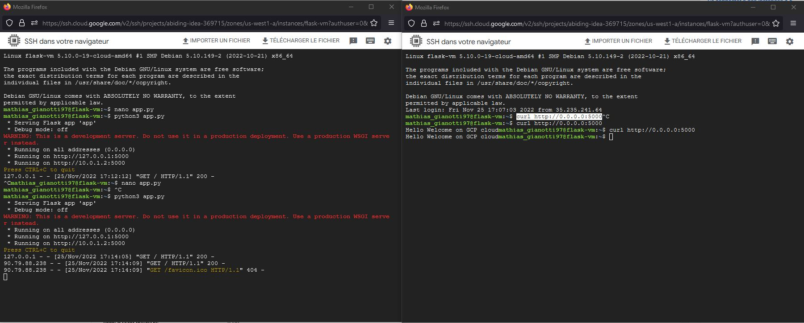
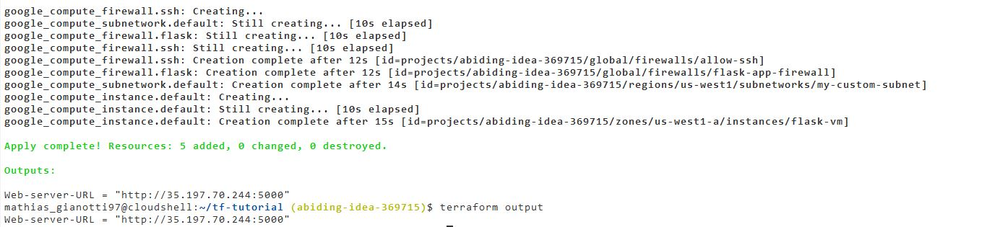

# GCP-Terraform-tutoriel
Tutoriel https://cloud.google.com/docs/terraform/get-started-with-terraform

## Deploy VM with Terraform 

## Get HTTP adress from the web serveur deploy with VM thanks to Terraform

## Result 

